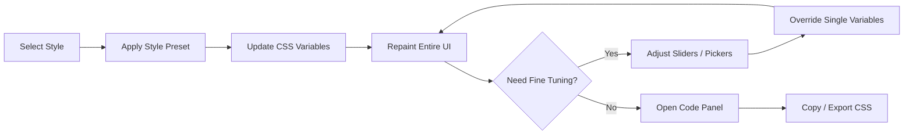

#  Web Style Visualisation

[中文文档](./README_zh.md)


> An interactive style playground for designers and frontend developers: Select a design style, and the entire site UI will switch in real-time, supporting fine-grained parameter tuning and CSS export.

## What & Why

`Web Style Visualisation` solves a high-frequency problem:

- Design styles are usually just shown in screenshots, making it impossible to intuitively see the true effect of "whole-site consistency".
- Learners might know the concepts (like `Flat Design`, `Glassmorphism`), but struggle to quickly grasp their differences in real components.
- When teams discuss style schemes, there is often a lack of an interactive demonstration carrier with copyable parameters.

The core value of this project:

- Use the same page skeleton to demonstrate multiple design styles, ensuring fair comparisons.
- Use `CSS Variables` as a unified abstraction layer, making both "style switching" and "parameter fine-tuning" easily explainable, reusable, and exportable.
- Lower the barrier for community contributions; adding a new style merely requires submitting a JSON file.

## Table of Contents

- [Core Features](#core-features)
- [Quick Start](#quick-start)
- [Core Interaction Model](#core-interaction-model)
- [Style Spectrum](#style-spectrum)
- [Tuning System](#tuning-system)
- [Technical Architecture](#technical-architecture)
- [Data Model & Auto-Discovery](#data-model--auto-discovery)
- [Project Structure (Target State)](#project-structure-target-state)
- [Deployment Plan](#deployment-plan)
- [Roadmap](#roadmap)
- [Contributing](#contributing)
- [License](#license)

## Core Features

| Module | Capability | Value to Developers |
|---|---|---|
| Style Switcher | One-click switch between `Flat / Glass / Neu / Brutal / Dark` | Quickly compare visual languages horizontally |
| Real-time Render | `Navbar`, `Hero`, `Card`, `Form`, `Stats` update synchronously | Verify style consistency across multiple components |
| Tuning Panel | Adjust parameters like colors, radius, shadows, fonts, spacing | Conduct "progressive style exploration", not an either/or choice |
| Code Panel | Real-time display of current variable sets with copy/export | Direct implementation in business projects |
| JSON Extension | Auto-loads after adding new style files | Lowers the cost of open-source contribution |

## Quick Start

The current repository is in the `docs-first` phase (currently only contains documents). The following commands are for the standard development workflow after code initialization:

```bash
git clone <repo-url>
cd web-style-visualisation
npm install
npm run dev
```

Common commands:

```bash
npm run build
npm run preview
npm run validate
```

## Core Interaction Model

### Interaction Snapshot (ASCII)

```text
┌───────────────────────────────────────────────────────────────────────┐
│  Web Style Visualisation                          [Style ▼] [Code]   │
├───────────────────────────────────────────────────────────────────────┤
│  Style Selector: [Flat] [Glass] [Neu] [Brutal] [Dark] [More ▼]      │
│                                                                       │
│  Live Preview Area                                                    │
│  ┌─────────────────────────────────────────────────────────────────┐  │
│  │ Hero / Cards / Form / Stats all update in real time           │  │
│  └─────────────────────────────────────────────────────────────────┘  │
│                                                                       │
│  Tuning Panel                                                         │
│  ┌─────────────────────────────────────────────────────────────────┐  │
│  │ Color • Radius • Shadow • Font • Special Effects              │  │
│  └─────────────────────────────────────────────────────────────────┘  │
│                                                                       │
│  Code Panel                                                           │
│  ┌─────────────────────────────────────────────────────────────────┐  │
│  │ :root { --color-primary: ...; --border-radius: ...; ... }     │  │
│  └─────────────────────────────────────────────────────────────────┘  │
└───────────────────────────────────────────────────────────────────────┘
```

### Interaction Flow



## Style Spectrum

### Classic Basic Styles

| Style | Key Features | Core Variables |
|---|---|---|
| `Flat Design` | Minimalist, no shadows, `2D`, large color blocks | `--shadow: none`, `--radius: 0` |
| `Flat Design 2.0` | Flat + soft shadows + soft gradients | `--shadow-soft`, `--gradient-soft` |
| `Material Design` | Paper layers, readable depth system | `--elevation-*`, `--radius: 8px` |
| `Skeuomorphism` | Realistic materials, textures, and inner shadows | `--shadow-inset`, `--gradient-rich` |

### Modern Trending Styles

| Style | Key Features | Core Variables |
|---|---|---|
| `Glassmorphism` | Translucent + background blur | `--backdrop-blur`, `--bg-opacity` |
| `Neumorphism` | Same-color scheme raised/pressed | `--shadow-light`, `--shadow-dark` |
| `Claymorphism` | Rounded blocks + soft 3D feel | `--radius: 24px`, `--shadow-dual` |
| `Brutalism` | Thick borders, hard shadows, strong contrast | `--border-width: 3px`, `--font: monospace` |

### Themes and Atmospheres

| Style | Key Features | Core Variables |
|---|---|---|
| `Dark Mode` | Dark background, low glare, focused content | `--bg: #1e1e2e`, `--contrast` |
| `Retro / Pixel` | Pixelated feel, neon colors, low-res semantics | `--font-pixel`, `--glow-intensity` |
| `Futuristic / Sci-Fi` | HUD language, scanning animations, glowing borders | `--glow-color`, `--scan-speed` |

## Tuning System

All styles share a common set of "Universal Parameters"; additional "Special Parameters" are appended when specific styles are selected.

### Universal Parameters

| Category | Control | CSS Variable | Range |
|---|---|---|---|
| Color | Color Picker | `--color-primary` | Any |
| Color | Color Picker | `--color-bg` | Any |
| Color | Color Picker | `--color-text` | Any |
| Radius | Slider | `--border-radius` | `0 ~ 32px` |
| Shadow | Slider | `--shadow-x` / `--shadow-y` | `-20 ~ 20px` |
| Shadow | Slider | `--shadow-blur` | `0 ~ 40px` |
| Font | Select | `--font-family` | Preset list |
| Weight | Slider | `--font-weight` | `100 ~ 900` |
| Spacing | Slider | `--spacing` | `4 ~ 32px` |
| Border | Slider | `--border-width` | `0 ~ 6px` |

### Special Parameters (By Style)

| Style | Parameter | CSS Variable | Description |
|---|---|---|---|
| `Glassmorphism` | Blur Intensity | `--backdrop-blur` | Core parameter for frosted glass |
| `Glassmorphism` | Opacity | `--bg-opacity` | Controls panel/card transparency |
| `Neumorphism` | Raised / Pressed | `--neu-type` | `raised` / `pressed` |
| `Brutalism` | Offset | `--brutal-offset` | Hard shadow offset |
| `Material Design` | Elevation | `--elevation` | Corresponds to Material depth |
| `Futuristic / Sci-Fi` | Scan Speed | `--animation-speed` | HUD animation rhythm |

## Technical Architecture

### Tech Stack Selection

| Layer | Technology | Reason for Choice |
|---|---|---|
| Build | `Vite` | Fast startup, fast HMR, lightweight config |
| Logic | `Vanilla JS` | No framework mental burden, easy for teaching and extending |
| Styling | `Vanilla CSS` + `CSS Variables` | Variable-driven, low cost for style switching |
| Highlighting | `Prism.js` | Lightweight and controllable |
| Deployment | `GitHub Pages` + `GitHub Actions` | Low-barrier automated publishing |

### Core Pattern: Variable-Driven

```css
:root {
  --color-primary: #3498db;
  --color-bg: #ffffff;
  --color-surface: #f5f5f5;
  --color-text: #333333;

  --border-radius: 8px;

  --shadow-x: 0px;
  --shadow-y: 2px;
  --shadow-blur: 8px;
  --shadow-color: rgba(0, 0, 0, 0.1);

  --font-family: "Inter", sans-serif;
  --font-weight: 400;
  --font-size-base: 16px;

  --spacing: 16px;
  --border-width: 1px;
  --border-color: #e0e0e0;

  --backdrop-blur: 0px;
  --bg-opacity: 1;
  --glow-intensity: 0;

  --transition-speed: 0.3s;
}
```

```javascript
function applyStyle(styleId) {
  const style = STYLES[styleId];
  const root = document.documentElement;

  Object.entries(style.variables).forEach(([key, value]) => {
    root.style.setProperty(key, value);
  });

  updateTuningPanel(style);
  updateCodePanel(style);
}

function onTuningChange(variableName, value) {
  document.documentElement.style.setProperty(variableName, value);
  updateCodePanel();
}
```

## Data Model & Auto-Discovery

### Style JSON Example

```json
{
  "id": "glassmorphism",
  "name": "Glassmorphism",
  "nameZh": "毛玻璃",
  "category": "modern",
  "description": "Frosted glass effect with blur and transparency",
  "descriptionZh": "通过模糊和半透明效果创造磨砂玻璃质感",
  "author": "your-github-username",
  "references": ["https://css.glass/"],
  "variables": {
    "--color-primary": "#6366f1",
    "--color-bg": "#0f0f23",
    "--color-surface": "rgba(255, 255, 255, 0.1)",
    "--color-text": "#ffffff",
    "--border-radius": "16px",
    "--shadow-blur": "32px",
    "--shadow-color": "rgba(31, 38, 135, 0.15)",
    "--backdrop-blur": "10px",
    "--bg-opacity": "0.1",
    "--border-width": "1px",
    "--border-color": "rgba(255, 255, 255, 0.2)"
  },
  "specialTuning": [
    {
      "variable": "--backdrop-blur",
      "label": "模糊强度",
      "type": "range",
      "min": 0,
      "max": 30,
      "unit": "px"
    }
  ],
  "keyProperties": [
    { "property": "backdrop-filter", "explanation": "Core: Blurs background content" },
    { "property": "background: rgba()", "explanation": "Translucency enhances the glass feel" }
  ]
}
```

### Auto-Discovery Mechanism

```javascript
const styleModules = import.meta.glob("./*.json", { eager: true });

export const STYLES = Object.fromEntries(
  Object.entries(styleModules)
    .filter(([path]) => !path.includes("_"))
    .map(([, mod]) => [mod.default.id, mod.default])
);
```

## Project Structure (Target State)

Note: The following structure represents the target directory after initialization. Currently, the repository is in the documentation phase.

```text
web-style-visualisation/
├── index.html
├── package.json
├── vite.config.js
├── README.md
├── CONTRIBUTING.md
├── src/
│   ├── main.js
│   ├── style.css
│   ├── styles/
│   │   ├── _template.json
│   │   ├── _schema.json
│   │   ├── index.js
│   │   └── *.json
│   ├── components/
│   │   ├── navbar.js
│   │   ├── hero.js
│   │   ├── cards.js
│   │   ├── form.js
│   │   ├── buttons.js
│   │   └── stats.js
│   ├── panels/
│   │   ├── style-selector.js
│   │   ├── tuning-panel.js
│   │   └── code-panel.js
│   └── utils/
│       ├── css-var-manager.js
│       └── export.js
├── scripts/
│   └── validate-styles.js
├── public/
│   └── fonts/
└── .github/
    └── workflows/
        ├── deploy.yml
        └── validate-pr.yml
```

## Deployment Plan

### GitHub Actions Workflow

```yaml
name: Deploy to GitHub Pages

on:
  push:
    branches: [main]

jobs:
  deploy:
    runs-on: ubuntu-latest
    permissions:
      pages: write
      id-token: write
    steps:
      - uses: actions/checkout@v4
      - uses: actions/setup-node@v4
        with:
          node-version: 20
      - run: npm ci
      - run: npm run build
      - uses: actions/upload-pages-artifact@v3
        with:
          path: dist
      - uses: actions/deploy-pages@v4
```

### Vite Basic Configuration

```javascript
export default {
  base: "/web-style-visualisation/",
  build: {
    outDir: "dist"
  }
};
```

## Roadmap

### Phase 1 (MVP)

- [ ] Initialize Vite project and GitHub Pages deployment
- [ ] Complete `CSS Variables` driven architecture
- [ ] Complete style selector, tuning panel, and code panel
- [ ] Built-in at least 8 style JSONs

### Phase 2 (Experience Enhancement)

- [ ] Two-column comparison mode
- [ ] Variable difference highlighting (Diff)
- [ ] URL parameter sharing
- [ ] Mobile adaptation

### Phase 3 (Advanced Capabilities)

- [ ] Style mix-and-match experiments
- [ ] Save custom styles (`localStorage`)
- [ ] Timeline evolution view
- [ ] More components: Table / Modal / Sidebar / Dashboard

## Contributing

- Document contributions: Feel free to directly submit improvements to `README` / `CONTRIBUTING`.
- Style contributions: Please refer to the JSON spec in [CONTRIBUTING.md](./CONTRIBUTING.md).
- Issue discussions: If you want to add a new style category or variable protocol, it's recommended to open an Issue first to align on the approach.

## License

This project is licensed under the [MIT License](./LICENSE).
