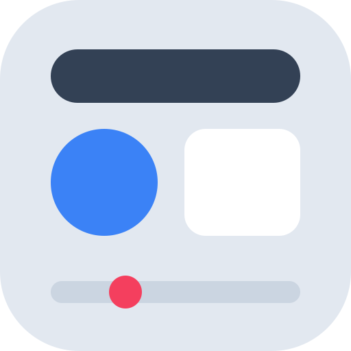

#  Web Style Visualisation

[English](./README.md)

> 一个面向设计师和前端开发者的设计风格工作台：选择一种风格，示例页面实时切换，细粒度微调参数，并导出 CSS。人和 AI Agent 都能直接操作。

**在线体验：** https://jarvisluk.github.io/Web_Style_Visualization/

## 这是什么？

Web Style Visualisation 让你**直观地看到和感受**不同的网页设计风格，而不只是停留在概念上。工作台分成三栏：

- **左栏：风格列表**，每个风格都带一张用它自己的配色绘制的缩略图。
- **中间：画布**，一个完整的示例产品页（导航、Hero、数据面板、功能卡片、表单、组件），整页跟随所选风格变化。可以在桌面、平板、手机三种宽度之间切换。
- **右栏：检查器**，分为「调参」「代码」「Agent」三个标签页。

工作台本身的界面使用独立的中性配色（支持浅色和深色），不会被正在预览的风格影响。

## 如何使用

### 1. 选择风格

点击左栏任意风格即可应用。

| 风格 | 视觉效果 |
|---|---|
| **Liquid Glass（液态玻璃）** | 明亮通透的玻璃层悬浮在鲜艳色彩之上，胶囊形圆角 |
| **Editorial（杂志编辑）** | 暖色纸张、墨色排版、细线分隔，超大衬线标题 |
| **Glassmorphism（毛玻璃）** | 半透明磨砂玻璃面板，背景模糊 |
| **Neumorphism（新拟态）** | 柔和的同色系凸起和凹陷 |
| **Claymorphism（黏土风）** | 圆润的 3D 体块，活泼的触感 |
| **Brutalism（野兽派）** | 粗边框、硬阴影、生猛排版 |
| **Flat Design（扁平设计）** | 干净极简，无阴影、无渐变 |
| **Material Design（质感设计）** | Material 3 色调与层级 |
| **Dark Mode（深色模式）** | 深色背景、低眩光 |
| **Retro / Pixel（复古像素）** | 像素字体、霓虹光晕、街机感 |

也可以选「自定义」，粘贴或上传一份 CSS 变量。

### 2. 微调参数

「调参」标签页可以调整颜色、圆角、边框、阴影、字体和间距。当前风格的专属参数（例如液态玻璃的折射模糊、复古像素的霓虹光晕）排在最前面。所有改动都会即时反映到画布上。

### 3. 导出 CSS

「代码」标签页显示当前外观对应的全部 CSS 变量，可以一键复制或下载为 `variables.css`。

### 4. 通过链接分享

地址栏会随你的改动实时更新（`?style=…&variables=…`），复制链接或点击顶栏的「复制链接」即可分享，对方打开后看到的效果完全一致。

## 配合 AI Agent 使用

网站和 Agent 之间有四种接入方式，Agent 会按环境自动选用最合适的一种。

### WebMCP（浏览器内 Agent）

网站会通过 [WebMCP](https://webmachinelearning.github.io/webmcp/) 向浏览器注册 8 个工具：`list_styles`、`get_current_style`、`get_variable_definitions`、`apply_style`、`set_variables`、`reset_style`、`export_css`、`get_share_url`。在支持 `document.modelContext` 的浏览器里，浏览器内的 Agent 可以直接调用这些工具，不需要写脚本。检查器的「Agent」标签页会显示当前浏览器是否支持。

### `window.WebStyleAPI`（浏览器自动化）

Playwright、browser-use 这类工具可以直接调用页面上的 JS API，例如：

```js
WebStyleAPI.applyStyle("liquid-glass");
WebStyleAPI.applyVariables({ "--color-primary": "#ff375f" }); // 在当前风格基础上合并
WebStyleAPI.exportCSS();
```

### URL 参数

```
?style=editorial
?style=editorial&variables={"--color-accent":"#2563eb"}
```

只传 `variables` 时，会以 `flat` 为基础合并。

### Agent Skill（编程助手）

`web-style-skill/` 是一个 Agent Skill，安装后 Claude Code、Codex、Cursor 等编程助手可以生成风格、给出预览链接，或者完全离线地输出 CSS：

- **Claude Code**：复制到 `~/.claude/skills/`
- **Codex**：复制到 `~/.codex/skills/`
- **Cursor**：复制到项目中或 Cursor 能发现 Skill 的目录

## 参与贡献

- **添加新风格**：参照 `src/styles/_template.json` 新建一个风格 JSON，运行 `npm run validate` 校验，再运行 `npm run sync:skill` 把预设同步到 Skill 的离线脚本
- **改了中文文案**：运行 `npm run subset:pixel -- --source <字体文件>`，重新生成复古像素风格用的中文点阵字体子集（[缝合像素字体](https://github.com/TakWolf/fusion-pixel-font)，SIL OFL 1.1，脚本开头写明了源字体的获取方式）
- **改进网站**：提交 Issue 或 Pull Request
- **报告问题**：在 GitHub 上提 Issue

详见 [CONTRIBUTING.md](./CONTRIBUTING.md)。

## License

本项目采用 [MIT License](./LICENSE)。
